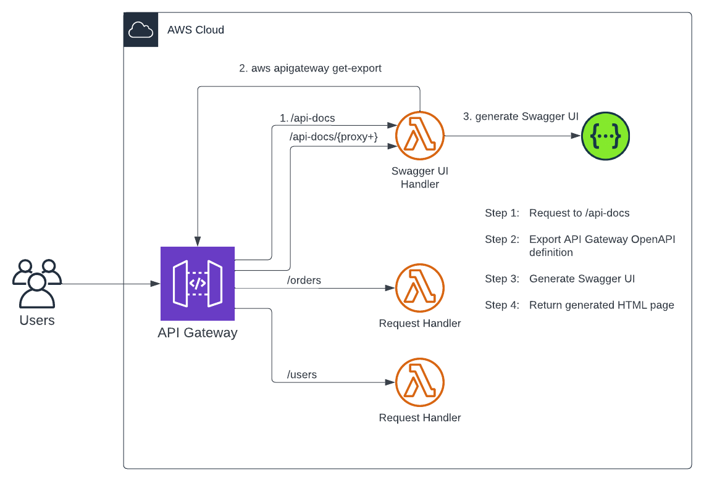
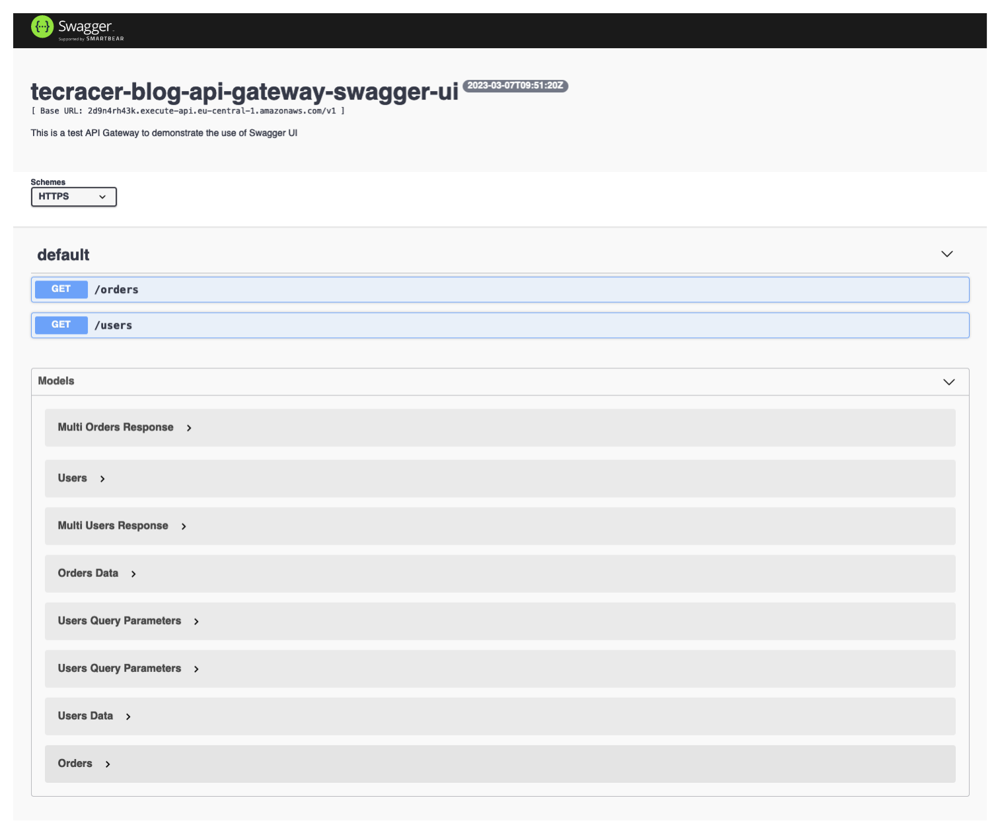

# Serverless Swagger UI for AWS API Gateway

This is the repository for the official tecRacer blog post [Serverless Swagger UI for AWS API Gateway](https://www.tecracer.com/blog/2023/03/serverless-swagger-ui-for-aws-api-gateway.html).

## Architecture

In order to demonstrate the use of Swagger UI in combination with the API Gateway, we will deploy the example infrastructure shown below. The setup is straightforward forward and we only need an API Gateway with a few resources and a couple of Lambdas to handle our requests.

In this example, we will create an API Gateway with three resources. The first resource `/orders` is an example resource and is only necessary to demonstrate the Swagger UI Lambda functionality. Our Swagger UI will be reachable via the parent resources `/api-docs` and child resource `/api-docs/{proxy+}`. To pass our API requests to the Lambda functions, Lambda proxy integrations are used. Once a GET request has been passed to our `/api-docs` endpoint, the Swagger UI Lambda will export the current API Gateway Swagger definition via AWS API calls. Afterward an express web server will be started that will serve an HTML page for our Swagger UI. The HTML page will be generated based on the API Gateway Swagger Export. This ensures that our Swagger UI is always up-to-date.

## Try it yourself

### Prerequisites

- [Terraform](https://developer.hashicorp.com/terraform/downloads)
- An AWS Account

### Setup

1. Clone the repo
2. Run `terraform init` to initialize the Terraform environment
3. Run `terraform plan` and `terraform apply` to deploy the infrastructure
4. Open the URL which is returned by Terraform as the output`swagger_ui_endpoint`

### Result

Once Terraform has deployed the infrastructure, you should be able to visit the Swagger UI endpoint. Retrieve the URL for the Endpoint via the AWS Console or via the Terraform output. Make sure that the end of the URL looks like this `/v1/api-docs/`. The stage and the last `/` are especially important! The Swagger UI page should look like this.

### Customization

You can customize the API Gateway as much as you want. Add additional resources, add or adjust the API models, add additional code to the Lambda request handlers, and add a database to retrieve actual data. No matter what change you make to the API Gateway, due to the dynamic export, the Swagger UI should always be up to date.

IMPORTANT: Do not forget to deploy your API changes to the stage. When using Terraform use the command `terraform apply -replace=aws_api_gateway_deployment.this` to make a new deployment.

### Teardown

Run `terraform destroy` to remove the infrastructure.
