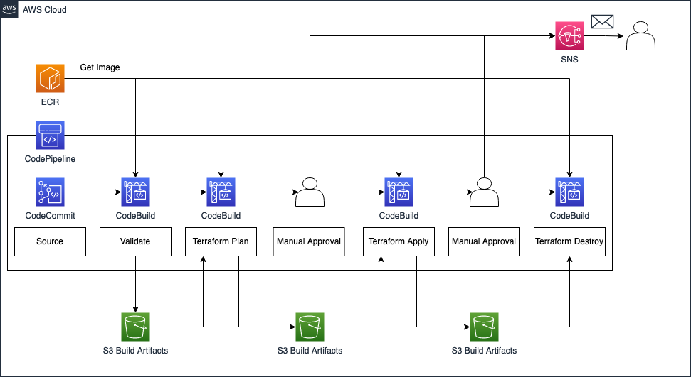

# Terraform CI/CD Pipelines: Use AWS CodePipeline to build fully-managed deployment pipelines for Terraform.

This is the repository for the official tecRacer blog post [Terraform CI/CD Pipelines: Use AWS CodePipeline to build fully-managed deployment pipelines for Terraform]().

# Architecture

First, I would like to guide you through the infrastructure that we will set up as part of this blog post. The diagram below displays the target architecture that we will build and deploy.

We will deploy an AWS CodePipeline consisting of multiple stages. The pipeline itself will consist of CodeCommit, CodeBuild, and Approval stages. AWS CodBuild will use a custom [Docker](https://www.docker.com/) image we will create and store in an AWS ECR. To propagate artifacts between stages, we will set up an S3 Bucket.

The first stage will be the `Source` stage. The source stage is the entry point for every CodePipeline and the first stage of every pipeline needs to contain at least one source action. In our example, we will use the AWS native source control repository CodeCommit. As we will build a CI/CD pipeline for Terraform, we will use CodeCommit as the entry point to our automation workflow and to store the Terraform configuration we want to deploy via the pipeline.

The second stage is the `Validation` stage. The validation stage will be used to validate our Terraform configuration and to run automated security and compliance checks. By running these checks at the start of the workflow, we follow the `fail fast` mentality and ensure that mistakes and compliance breaches are detected as soon as possible. This allows us to quickly intervene and make the necessary adjustment.

The third stage is the `Terraform Plan` stage. After having successfully passed the `Validation` stage, our pipeline will perform a `terraform plan` in order to compare our Terraform configuration with the existing AWS infrastructure and to evaluate the changes Terraform intends to make. We will store the plan output in a Terraform-specific binary file in our S3 artifact bucket. By capturing all changes in a binary artifact, we are able to reliably propagate the Terraform plan between stages. This ensures that only the changes that were reviewed are applied later. Adjustments that were introduced at a later stage and are not stored in the binary file, are ignored.

The fourth stage is the `Manual Approval` stage. After having generated a Terraform plan output and before applying the changes, we will implement an approval step. This step will guarantee, that our Terraform plan has been reviewed before the deployment. We will leverage AWS SNS to send notifications to the reviewer once this stage has been reached.

The fifth stage is the `Terraform Apply` stage. Once the Terraform plan output has been reviewed and approved, we will run `terraform apply` to deploy out Terraform configuration. The previously created plan binary will be used to ensure that only the reviewed changes are applied.

The sixth and seventh stage, `Manual Approval` and `Terraform Destroy`, are optional stages and are used in this example to provide a comfortable way to clean up the infrastructure after the Terraform deployment. The second `Manual Approval` stage will be used to approve the destruction of the infrastructure, while the `Terraform Destroy` stage is used to run the `terraform destroy` command. Afterward, the previously created resources will be gone.

## Try it yourself

### Prerequisites

- [Terraform](https://developer.hashicorp.com/terraform/downloads)
- [Docker](https://www.docker.com/)
- An AWS Account

### Setup

1. Clone the repo
2. Execute `docker build -t codebuild-image .` in the folder `docker/` to build the custom CodeBuild image
4. Run `terraform init` to initialize the Terraform environment
5. Run `terraform apply -target=aws_ecr_repository.this` to create an AWS Container Registry
6. Upload the custom CodeBuild image to ECR using the [official AWS documentation](https://docs.aws.amazon.com/AmazonECR/latest/userguide/docker-push-ecr-image.html)
7. Run `terraform plan` and `terraform apply` to deploy the rest of the infrastructure
8. Clone the CodeCommit repository and start implementing Terraform code

### Result

Terraform will deploy CodePipeline for automated Terraform deployments.

### Teardown

1. Delete the custom CodeBuild image from ECR
2. Run `terraform destroy` to remove the infrastructure
