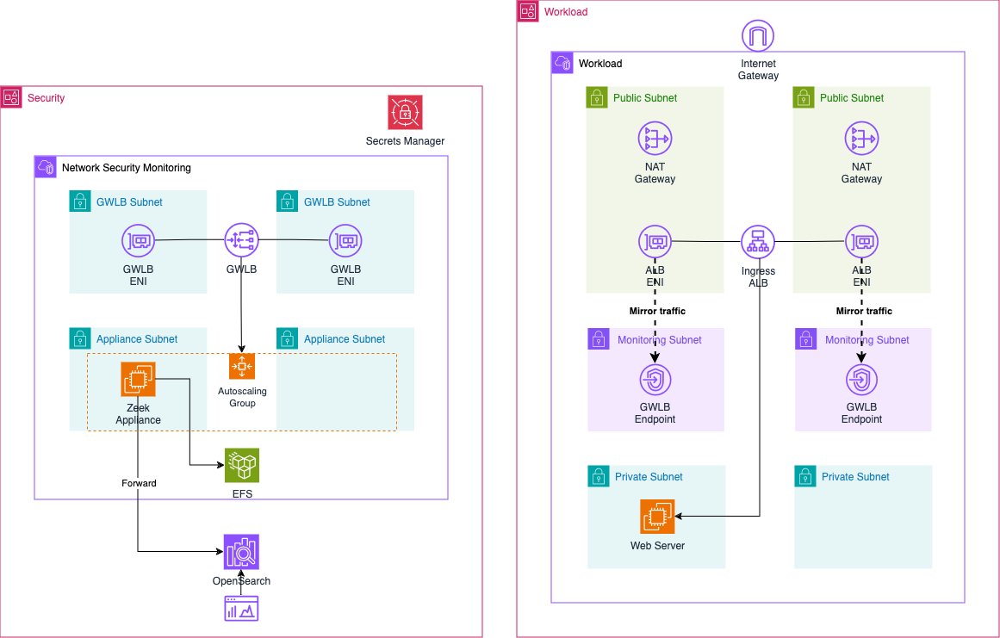
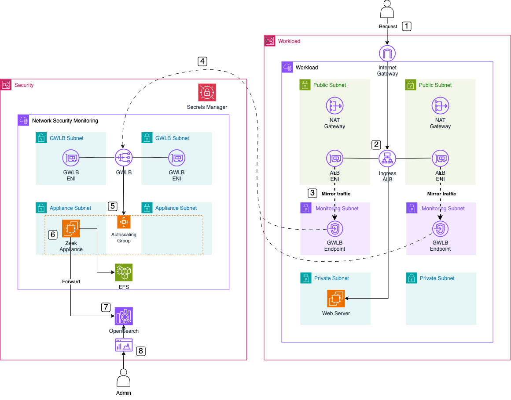
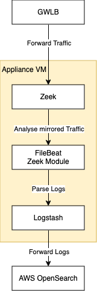

# Building a Cloud SIEM with AWS OpenSearch Security Analytics

This is the repository for the official tecRacer blog post [Building a Cloud SIEM with AWS OpenSearch Security Analytics](https://www.tecracer.com/blog/2024/09/building-a-cloud-siem-with-aws-opensearch-security-analytics.html).

## Architecture

To start, let's explore the architecture we’ll deploy in this example. The diagram below provides a high-level overview of the setup we aim to simulate. Our goal is to create a cloud-based SIEM solution in AWS, utilizing AWS OpenSearch Security Analytics, Zeek, and AWS Gateway Load Balancer.

The architecture spans two AWS accounts: the `Workload` Account and the `Security` Account. The `Security` Account hosts the `Network Security Monitoring` VPC, where the Zeek appliance operates behind an AWS Gateway Load Balancer. The Gateway Load Balancer allows a centralized, highly available, and scalable operation of the network analysis appliance, distributing traffic efficiently. We’ll use Gateway Load Balancer Endpoints to forward network traffic from multiple accounts to this central location via the GENEVE protocol, ensuring that the traffic reaches the Zeek appliance intact and unaltered. This design allows for a lightweight Zeek integration in each monitored account.

The Zeek appliance is deployed within an AWS Auto Scaling Group, ensuring resilience by recovering automatically in case of instance failure or availability zone outages. In a clustered setup, the Auto Scaling Group could potentially dynamically scale Zeek workers based on the volume of network traffic requiring analysis. The logs analyzed by Zeek are forwarded to an AWS OpenSearch cluster in the same account, and logs are also stored persistently on a highly available Amazon EFS (Elastic File System). This ensures that logs remain available even if an instance terminates unexpectedly, and it also enables replaying logs to OpenSearch if needed. Security administrators can use OpenSearch Dashboards to analyze ingested log files, while OpenSearch Security Analytics provides advanced threat detection and alerting capabilities.

In the `Workload` Account, we have the `Workload` VPC, which hosts a sample web server behind an internet-facing Application Load Balancer (ALB). This VPC is divided into three subnet types: GLWB, Public, and Private. The GLWB subnets contain the Gateway Load Balancer Endpoints, which are connected to the Gateway Load Balancer in the Security VPC. Users can access the web server via the Application Load Balancer. To analyze the traffic reaching the ALB, AWS Traffic Mirroring is used. We’ll mirror traffic from the ALB’s Elastic Network Interfaces (ENIs) and forward it to the Gateway Load Balancer Endpoints in the Workload VPC. This mirrored traffic is then sent to the Zeek appliance via the Gateway Load Balancer.

This setup enables centralized network analysis within AWS, running in parallel to the deployed workloads without interfering with their operation.

## Traffic Flow

Now, let's dive into the ingress traffic flow when using our Zeek setup with a Gateway Load Balancer.

1. **User Request**: The user sends a request to the DNS name of the Application Load Balancer (ALB) to access the web server.

2. **Request Handling**: The ALB forwards the request to the web server, which processes it and sends a response back to the user.

3. **Traffic Mirroring**: AWS Traffic Mirroring mirrors the traffic flowing through the ALB’s Elastic Network Interface (ENI). The mirrored traffic is sent to the Gateway Load Balancer Endpoint (GWLB Endpoint) in the Workload VPC.

4. **Forward to GWLB**: The GWLB Endpoint receives the mirrored traffic, encapsulates it using the GENEVE protocol, and forwards it to the Gateway Load Balancer (GWLB) in the Inspection VPC.

5. **Send to Zeek**: The GWLB forwards the encapsulated traffic to the Zeek appliance, which is part of the target group behind the Gateway Load Balancer.

6. **Traffic Analysis**: The Zeek appliance removes the GENEVE encapsulation, analyzes the network traffic, and generates log files ready for ingestion into OpenSearch.

7. **Log Forwarding**: The Zeek appliance forwards the analyzed logs to the AWS OpenSearch Cluster using Logstash for centralized storage and indexing.

8. **Log Analysis**: Once the logs are ingested, security experts can use the OpenSearch Dashboard for network traffic analysis and OpenSearch Security Analytics for threat detection and alerting.

## Zeek Appliance Workflow

Before deploying the solution, let’s briefly review the workflow of the appliance and the tools used for analyzing, parsing, and forwarding the log files.

Mirrored traffic from the Workload Account arrives at the Zeek appliance, encapsulated in the GENEVE protocol through the Gateway Load Balancer on port 6081. Zeek attempts to decapsulate traffic using this UDP destination port. Once decapsulated, Zeek analyzes the network traffic and generates a set of log files.

These log files are then parsed by Filebeat, using the Zeek module for structured parsing. Filebeat is a lightweight shipper that forwards and centralizes log data. Installed on your servers, Filebeat monitors specified log files or locations, collects log events, and forwards them to either Elasticsearch or Logstash for indexing. The Zeek module specifically handles the parsing of Zeek log files.

After parsing, the logs are collected by Logstash and then forwarded to the AWS OpenSearch cluster for further analysis.

## Try it yourself

### Prerequisites

- [Terraform](https://developer.hashicorp.com/terraform/downloads)
- An AWS Account

### Setup

As this example includes manual configuration steps, please follow the step-by-step instructions of the original [blog post](https://www.tecracer.com/blog/2024/09/building-a-cloud-siem-with-aws-opensearch-security-analytics.html).

### Result

Terraform will deploy an AWS OpenSearch cluster along with a Zeek network monitoring appliance, both of which can be integrated to build a cloud-based SIEM.

### Teardown

Run `terraform destroy` to remove the infrastructure
