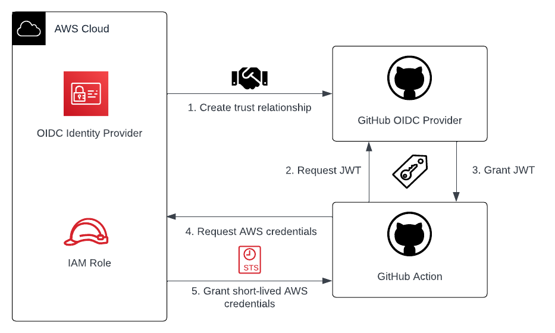

# Secretless Terraform Deployment: Use GitHub Actions and AWS OpenID Connect identity providers to build a secretless IaC deployment pipeline

This is the repository for the official tecRacer blog post [Secretless Terraform Deployment: Use GitHub Actions and AWS OpenID Connect identity providers to build a secretless IaC deployment pipeline]().

## Workflow

The workflow when using GitHub Actions in combination with AWS IAM OIDC identity providers can be divided into five steps which are shown in the figure below.

1. Register GitHub as IAM OIDC Identity Provider in AWS and create an IAM role IdP identities are allowed to assume.
2. GitHub Action requests a signed JWT during the job run from the GitHub OIDC provider.
3. GitHub OIDC provider issues signed JWT to GitHub Action.
4. GitHub Action sends JWT and ARN of the IAM role which should be assumed to AWS.
5. AWS validates JWT and grants short-lived credentials to GitHub Action.

Once the credentials have been granted by AWS, the GitHub Action can use the permissions to access AWS resources.

## Try it yourself

### Prerequisites

- [Terraform](https://developer.hashicorp.com/terraform/downloads)
- [GitHub API Key](https://docs.github.com/de/authentication/keeping-your-account-and-data-secure/creating-a-personal-access-token) 

### Setup

1. Clone the repo
2. Export GitHub API key as environment variable via `export GITHUB_TOKEN=XXXXXX`
3. Set Terraform variables for `org_or_user_name` and `repository_name`
4. Run `terraform init` to initialize the Terraform environment
5. Run `terraform plan` and `terraform apply` to deploy the infrastructure
6. Create GitHub Pull Request from `dev` to `main` branch
7. Merge `dev` into `main`

### Result

Once Terraform has deployed the configuration, you should have an IAM identity provider including the IAM role set up. Terraform should also have created a GitHub repository with `dev` and `main` branch as well as a GitHub Action that functions as a Terraform deployment pipeline. The GitHub Action is preconfigured to assume the IAM role and use the temporary credentials to deploy AWS Infrastructure. 

### Customization

Feel free to use your own Terraform configuration or adjust the GitHub Action to better suit your needs. If you are looking for a challenge, feel free to implement a step that lets you perform `terraform destroy`.

### Teardown

Run `terraform destroy` to remove the infrastructure.