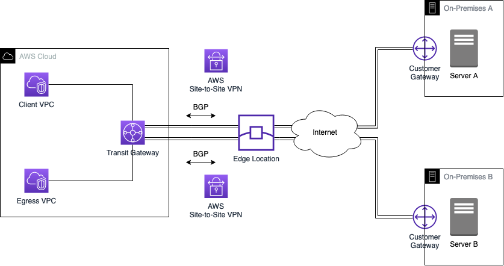
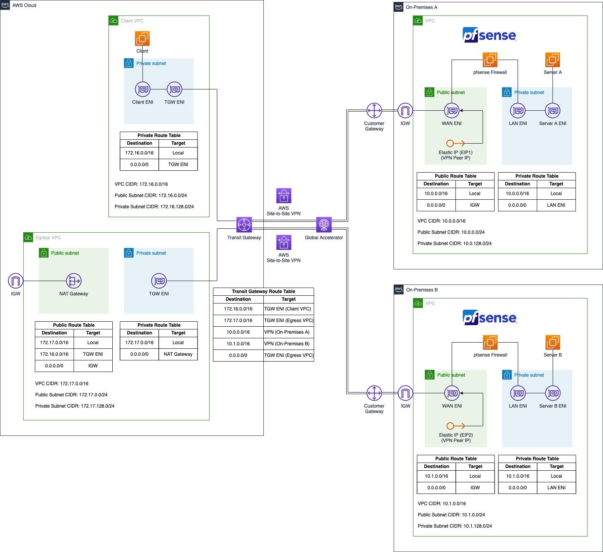

# Multiple Site-to-Site VPN Connections in AWS Hub and Spoke Topology

This is the repository for the official tecRacer blog post [Multiple Site-to-Site VPN Connections in AWS Hub and Spoke Topology]().

# Architecture

As an introduction, I would like to guide you through the infrastructure that we will set up as part of this blog post. The diagram below displays a high-level overview of the setup we are trying to simulate.

The goal is to create an IPSec Site-to-Site VPN tunnel between AWS and two On-Premises networks. We will leverage AWS Site-to-Site VPNs to create the connections in combination with AWS Global Accelerator to implement a highly available and performant VPN solution. To create a hub and spoke network topology and increase the performance of our VPNs, we will use AWS Transit Gateway and ECMP. Furthermore, we will use BGP to dynamically exchange routes between AWS and the On-Premises data centers. This setup will allow us to establish reliable and secure communication between all parties. The diagram below displays the target architecture in greater detail.

We will set up four VPCs in AWS. The VPCs `Client VPC` and `Egress VPC` on the left-hand side will represent the AWS network while the two VPCs on the right-hand side will simulate the on-premises network `On-Premises A` and `On-Premises B`. Both the on-premises networks will be connected to the AWS network using AWS Site-to-Site VPN tunnels.

The Client VPC will consist of a single private subnet and will house a single application server that needs to communicate with both the on-premises networks as well as the public Internet via the Egress VPC. The centralized Egress VPC will consist of two subnets. A private subnet as well as a public subnet. A NAT Gateway will be present in the public subnet to allow the applications located in private subnets to communicate with the public Internet. 

The setup of the two on-premises VPC will be identical in nature. Each environment will consist of a VPC with two subnets, a private and a public subnet. The private subnet will contain a server that the client in the Client VPC needs to reach. The public subnet will contain the `pfSense` appliance that we will use to create a Site-to-Site VPN connection between the AWS network and our simulated on-premises setup.

The pfSense EC2 instance will have two Elastic Network Interfaces, a `LAN ENI` as well as a `WAN ENI`. The LAN ENI will be placed in the corresponding private subnet of each VPC and will allow EC2 instances running in the private subnets to forward VPN traffic to the virtual appliance. The LAN ENI will only be assigned a private IP address. The WAN ENI will be placed in the public subnet of the VPCs and will function as the entry point to the networks. Besides the private IPs, they will also be assigned a static public IP each by using `Elastic IPs`. The public IPs will be used as the `VPN Peer IPs` and will allow the creation of an IPSec VPN connection between the two VPCs.

In order to create a hub and spoke network and allow communication between all parties, we will leverage AWS Transit Gateway. The Transit Gateway will be attached to both the Client VPC and the Egress VPC directly via Transit Gateway VPC Attachments. To establish a connection to the on-premises networks, AWS Site-to-Site VPN Attachments will be used. We will leverage both ECMP and AWS Global Accelerator in combination with the Transit Gateway to increase the throughput and reliability of our VPN connections. Routes between AWS and the on-premises networks will be exchanged via BGP.

## Try it yourself

### Prerequisites

- [Terraform](https://developer.hashicorp.com/terraform/downloads)
- An AWS Account

### Setup

As this example includes manual configuration steps, please follow the step-by-step instructions of the original [blog post]().

### Result

Terraform will deploy a Hub and Spoke network topology including multiple AWS Site-to-Site VPN connections to simulated on-premises data centers.

### Teardown

Run `terraform destroy` to remove the infrastructure
