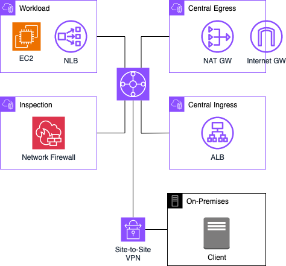
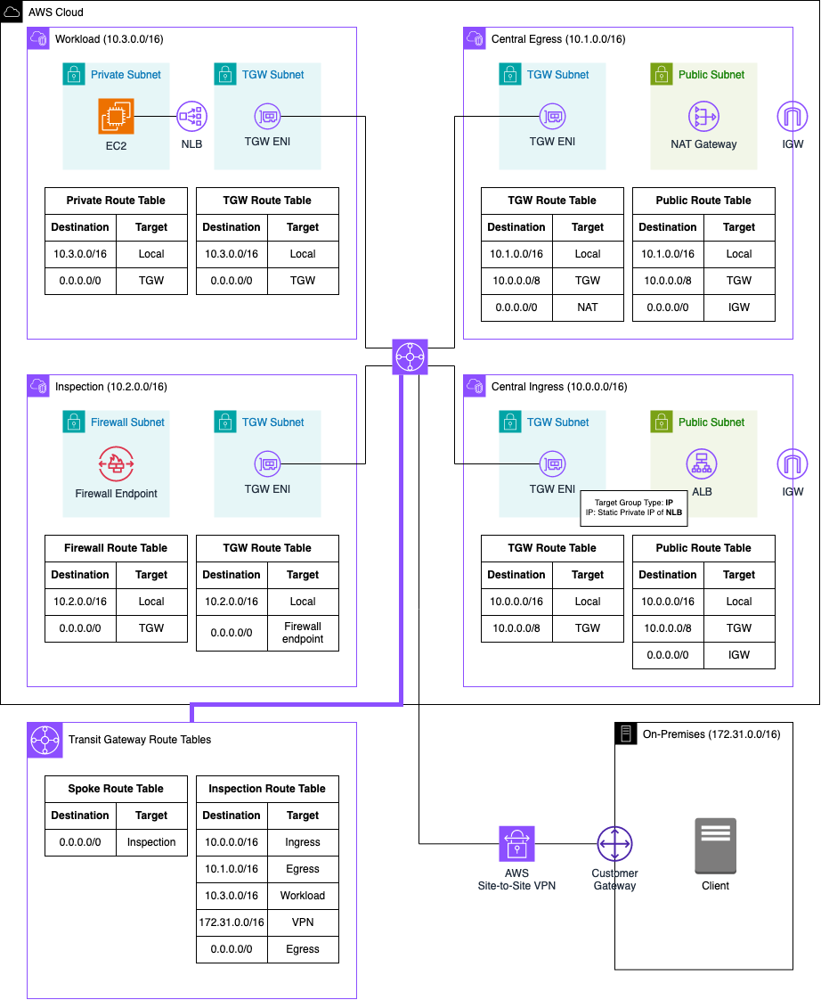
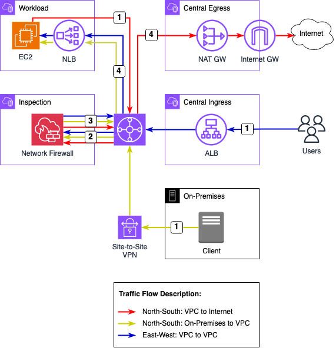

# Centralized traffic filtering using AWS Network Firewall

This is the repository for the official tecRacer blog post [Centralized traffic filtering using AWS Network Firewall](https://www.tecracer.com/blog/2023/11/centralized-traffic-filtering-using-aws-network-firewall.html).

## Architecture

I would like to start by introducing the infrastructure that we are going to deploy as part of this blog post. The architecture diagram below provides a high-level snapshot of the components and workflow we are about to implement. Our objective is to build a Hybrid Hub and Spoke Network topology including a centralized AWS Network Firewall to conduct comprehensive network traffic analysis and filtering.

The Hub and Spoke network is designed with four Virtual Private Clouds (VPCs) interconnected through a Transit Gateway. The primary VPC, referred to as the `Workload` VPC, serves as the home for our enterprise workload. In this example, an Apache web server is deployed, accessible both from the On-Premises network and the Internet. Two additional VPCs, namely `Central Ingress` and `Central Egress`, are established to segregate incoming and outgoing traffic.

Within the `Central Ingress` VPC, an `Application Load Balancer` is configured to forward incoming requests from the Internet to the web server hosted in the `Workload` VPC. The `Central Egress` VPC allows the connectivity of the EC2 instance within the `Workload` VPC to the Internet, enabling the download of necessary packages and software.

To ensure comprehensive security, all traffic, including communication between different entities and in all directions, is monitored by the `AWS Network Firewall`. This security infrastructure is implemented within the `Inspection` VPC.

Additionally, an `On-Premises` location, housing clients seeking access to the web server through the private network, is integrated into the Hub and Spoke network via an `AWS Site-to-Site VPN` connection. For the purposes of this illustration, the On-Premises VPN connection will be configured and emulated using an AWS Virtual Private Cloud (VPC) in tandem with an EC2 instance operating `StrongSwan`. The traffic between the web server and the On-Premises clients is also routed through the `Inspection` VPC, allowing for continuous monitoring and filtering of data.

Below is an enhanced depiction of the architecture, presenting a more detailed diagram featuring the specific components to be deployed, along with Subnet and Transit Gateway routing tables for comprehensive understanding.

## Traffic Flow

After having given a quick overview of the Hub and Spoke topology, we will make a deep dive into the different traffic flows that will be analysed as part of this example. The digramm below highlights the traffic flow permutations that we will encounter.

We will encounter three distinct flows as part of the example. `North-South: VPC egress to Internet`, `North-South: On-Premises to VPC`, and `East-West: VPC to VPC`. 

### North-South: VPC egress to Internet

1. Following the deployment of our infrastructure, the EC2 instance in the Workload VPC initiates the download of necessary packages and software essential for operating our Apache web server. The traffic exits the Workload VPC and is directed to the Transit Gateway. The subsequent forwarding of this traffic is determined by the associated Transit Gateway Route Table linked with the VPC attachment.

2. The outbound traffic flows to the Inspection VPC and, therefore, to the Network Firewall. This configuration enables thorough analysis and filtering of outgoing traffic. We have the flexibility to impose restrictions based on specific criteria, such as domain names. For instance, internet access can be limited only to hostnames provided by the Server Name Indication (SNI).

3. Upon completion of the outgoing traffic analysis, if no filtering occurs as per the network firewall rules, the traffic is routed back to the Transit Gateway. The following forwarding of this traffic is once again determined by the Transit Gateway Route Table linked with the VPC attachment.

4. Outbound traffic intended for the public Internet is directed to the Central Egress VPC. Within this VPC, the traffic is routed through a NAT Gateway, proceeding to an Internet Gateway, and finally reaching its destination in the public Internet. The return traffic follows the same route as the outbound traffic, allowing for analysis of traffic and comprehensive filtering of return traffic.

### North-South: On-Premises to VPC

1. Once the Apache web server is operational, clients within our On-Premises network can initiate access attempts to the web server. Traffic from the client is directed to the Transit Gateway through the AWS Site-to-Site VPN connection. The Transit Gateway VPN attachment is associated with a specific route table, which dictates the subsequent routing decisions.

2. The incoming traffic is directed to the Inspection VPC and the Network Firewall for thorough analysis and filtering based on the configured firewall settings. The AWS Network Firewall provides extensive flexibility, supporting both self-managed and AWS-managed firewall rules, allowing us to filter traffic based on a myriad of criteria.

3. Following the analysis of incoming traffic, if no filtering occurs as dictated by the network firewall rules, the traffic is routed back to the Transit Gateway. The subsequent forwarding of this traffic is determined once again by the Transit Gateway Route Table linked with the associated VPC attachment.

4. Incoming traffic destined for the web server is then routed to the Workload VPC and directed to the EC2 server hosting the web server. The return traffic follows the same route as the outbound traffic, enabling a detailed analysis of traffic and comprehensive filtering of return traffic.

### East-West: VPC to VPC

1. With the Apache web server operational, external clients on the Internet can initiate access attempts through an Application Load Balancer sitting in the Central Ingress VPC. This Load Balancer actively listens for incoming requests and forwards traffic to the web server. Given that the web server resides in a separate VPC, the traffic is initially routed through the Transit Gateway. The subsequent forwarding of this traffic is determined by the associated Transit Gateway Route Table linked with the VPC attachment.

2. The incoming traffic is directed to the Inspection VPC and the Network Firewall for thorough analysis and filtering based on the configured firewall settings. The AWS Network Firewall provides extensive flexibility, supporting both self-managed and AWS-managed firewall rules, allowing us to filter traffic based on a myriad of criteria.

3. Following the analysis of incoming traffic, if no filtering occurs as dictated by the network firewall rules, the traffic is routed back to the Transit Gateway. The subsequent forwarding of this traffic is determined once again by the Transit Gateway Route Table linked with the associated VPC attachment.

4. Incoming traffic destined for the web server is then routed to the Workload VPC and directed to the EC2 server hosting the web server. The return traffic follows the same route as the outbound traffic, enabling a detailed analysis of traffic and comprehensive filtering of return traffic.

## Try it yourself

### Prerequisites

- [Terraform](https://developer.hashicorp.com/terraform/downloads)
- An AWS Account

### Setup

1. Clone the repository to your local machine.
2. Navigate to the `network` folder.
3. Initialize the Terraform environment by executing `terraform init`.
4. Deploy the infrastructure using `terraform plan` followed by `terraform apply`.
5. Access the deployed Apache web server from the public internet through the Application Load Balancer. Obtain the DNS name from the Terraform output `ingress_alb_dns_name`.
6. Access the Apache web server from the on-premises network via the Network Load Balancer. Find the DNS name in the Terraform output `workload_nlb_dns_name`. Utilize AWS Session Manager to connect to the On-Premises client through the AWS Console.
7. Remove the blockage of traffic from the On-Premises Network. Open the file `terraform.tfvars`, locate the variable `network_firewall_on_premises_action`, and change its value from `DROP` to `PASS`.
8. Deploy the changes using `terraform plan` followed by `terraform apply`.
9. Retry accessing the web server from the On-Premises client. It should now succeed.

### Result

In our Hybrid Hub and Spoke network, we will utilize AWS Network Firewall to efficiently analyze, monitor, and filter both incoming and outgoing network traffic across all entities involved.

### Teardown

Run `terraform destroy` to remove the infrastructure
