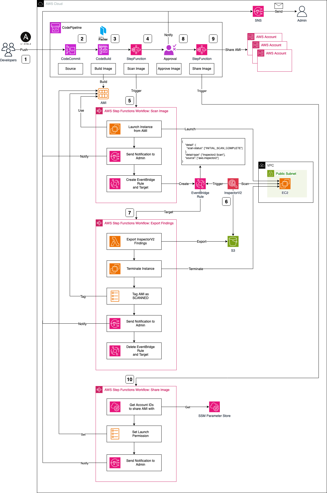

# Build Golden AMIs with Packer and AWS CodePipeline

This is the repository for the official tecRacer blog post [Build Golden AMIs with Packer and AWS CodePipeline](https://www.tecracer.com/blog/2023/11/build-golden-amis-with-packer-and-aws-codepipeline.html).

## Architecture

I would like to start by introducing the infrastructure that we are going to deploy as part of this blog post. The architecture diagram below provides a high-level snapshot of the components and workflow we are about to implement. Our objective is to build a CodePipeline complemented by two Stepfunctions to orchestrate the Golden AMI creation process.

The Workflow can be described as follows:

1. Developers will write `HashiCorp Packer-specific` configurations for AMI creation, including `Ansible` playbooks. This grants developers the flexibility to customize their images, install requisite software packages, and configure the system. Once playbooks and Packer configuration files are prepared, developers push their changes to a `CodeCommit` repository, triggering the `CodePipeline` AMI creation workflow.

2. The CodeCommit repository serves as the source for CodePipeline, initiating the workflow. While CodeCommit is the chosen source in this scenario, alternatives like GitHub, GitLab, or Bitbucket can be used as an alternative, offering the development team greater flexibility in selecting their tools and software.

3. Upon code submission to CodeCommit and the initiation of CodePipeline, the image build process starts using CodeBuild and HashiCorp Packer. CodeBuild downloads the necessary software and tools, executing `packer build`. Packer creates an AWS AMI based on the provided configuration files and pre-configures the AMI using the specified Ansible playbooks. Beyond creating a Golden AMI, our objective includes a deep security analysis to mitigate vulnerability risks. We will leverage `AWS StepFunction` to build these security scan workflows.

4. Post the successful creation of the AMI via Packer, CodePipeline triggers an AWS Stepfunctions Workflow. This initial workflow is part of a two-step process designed to perform a security scan on the AMI using AWS Inspector V2. In contrast to Inspector V1, Inspector V2 continually scans Amazon EC2 instances post-launch. 

5. To scan our AMI, an EC2 instance based on the new AMI is launched. The Stepfunctions workflow starts by launching this EC2 instance, notifying an administrator via SNS of the scan initiation, and configuring an EventBridge Rule and Target.

6. The EventBridge Rule reacts to Inspector V2 scans marked as `INITIAL_SCAN_COMPLETE`. After launching and setting up our EC2 instance, AWS Inspector V2 automatically performs a scan, triggering the EventBridge Rule upon completion. The associated Target, in turn, triggers our second Stepfunctions workflow.

7. The second StepFunction is tasked with exporting findings and alerting the administrator of potential vulnerabilities. The workflow begins by exporting Inspector findings using a Lambda function, storing them in an S3 bucket. The workflow continues by terminating the temporary scan EC2 instance, and tagging the AMI as SCANNED for easy identification. Subsequently, a notification is dispatched to the administrator via SNS, conveying the Inspector findings and completion of the process. Finally, the workflow deletes the EventBridge Rule and Target from the first workflow.

8. Post-creation and an inspection via Inspector, the Golden AMI is ready for sharing with member accounts of your organization or selected customers. Prior to sharing, approval is sought for both the Packer build and Inspector V2 results.

9. Once administrator approval is granted, CodePipeline initiates another Stepfunction step, facilitating the sharing of the newly created Golden AMI with predefined AWS accounts. 

10. The StepFunctions workflow commences by retrieving the Account IDs from the Systems Manager Parameter Store, stored as an SSM Parameter. After extraction, the launch permissions of the AMI are modified, and the administrator is promptly notified of this adjustment. This streamlined process ensures that shared AMIs align with company requirements, thanks to the standardized approach to image creation and security scans.

## Try it yourself

### Prerequisites

- [Terraform](https://developer.hashicorp.com/terraform/downloads)
- An AWS Account

### Setup

1. Begin by cloning the repository.
2. Navigate to the `packer-pipeline` folder.
3. Initialize the Terraform environment by running `terraform init`.
4. Deploy the infrastructure with `terraform plan` followed by `terraform apply`.
5. Clone the CodeCommit repository generated by Terraform, utilizing either the `clone_url_http` or `clone_url_ssh` output.
6. Copy the contents from the `manifests` folder into the CodeCommit repository and push them to AWS.
7. Access the AWS Console and seamlessly follow the CodePipeline workflow to create, scan, and share your Golden AMI.

### Result

We will leverage AWS CodePipeline and AWS Stepfunctions, along with Terraform and Packer, to establish a fully automated pipeline for creating Golden AMIs.

### Teardown

Run `terraform destroy` to remove the infrastructure
