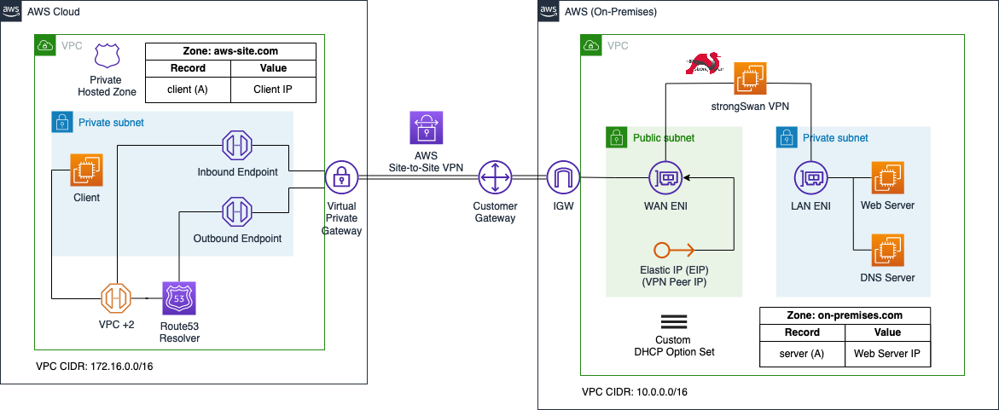
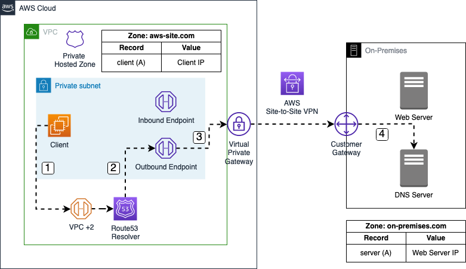
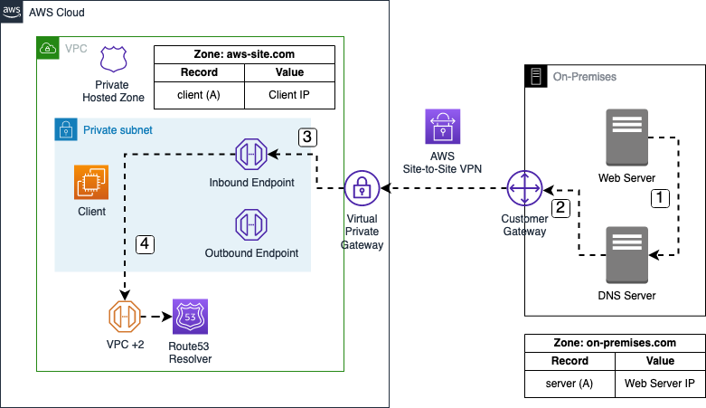

# Hybrid DNS resolution using Route 53 Endpoints

This is the repository for the official tecRacer blog post [Hybrid DNS resolution using Route 53 Endpoints](https://www.tecracer.com/blog/2023/08/hybrid-dns-resolution-using-route-53-endpoints.html).

## Architecture

To start, I would like to guide you through the architecture we are planning to deploy as part of this example. The diagram below displays a high-level overview of the setup we are trying to simulate. The overall goal of this example is to create a hybrid network by connecting our AWS and on-premises network using an AWS Site-to-Site VPN. Furthermore, we will set up proper DNS resolution between the sites by leveraging Route53 Inbound and Outbound endpoints.

We will set up two VPCs as part of this example. The first VPC on the left-hand side will represent the AWS network while the VPC on the right-hand side will simulate the on-premises network. The on-premises network will be connected to the AWS network using AWS Site-to-Site VPN tunnels. Each network will also receive its own DNS zone. The AWS network will host the zone `aws-site.com`, while the on-premises network will host the zone `on-premises.com`.

The AWS VPC will consist of a single EC2 called `Client` that needs to communicate with the on-premises web server. Furthermore, we will implement a private hosted zone named `aws-site.com` in Route53 and a single A record called `client` that will point to the IP address of the Client EC2 instance. To allow DNS forwarding between AWS and the on-premises network, Route53 Inbound and Outbound endpoints will be implemented. The Inbound endpoint will be configured to only allow inbound traffic from the DNS server located in the on-premises network. The Inbound endpoint will receive static private IP addresses. We will configure the on-premises DNS server to forward queries for `aws-site.com` to these IP addresses. 

Once the Outbound endpoint has been created, we can implement forwarding rules and associate these rules with the endpoint. Forwarding rules allow you to forward DNS queries for specific domains to certain IP addresses that you define. In our example, we will create a rule that will forward queries for `on-premises.com` to the IP address of the on-premises DNS server. In order to establish a connection between the AWS and on-premises network via AWS Site-to-Site VPN, we will set up a Virtual Private Gateway as well as a Customer Gateway in the AWS VPC.

The on-premises environment will consist of a VPC with private and public subnets. The private subnet will contain a `Web Server` that the Client in the AWS VPC needs to reach. Besides the Web Server, we will also set up a custom `DNS Server` on an EC2 instance using `bind`. To ensure that the on-premises instances use our custom DNS server instead of the AWS Route53 Resolver, we will implement a custom DHCP option set and will configure our custom DNS server as the default VPC DNS server. We will configure a DNS zone called `on-premises.com` on the DNS server. In addition, we will define a single A record named `server` pointing to the IP of the web server in the zone file. The DNS server will be responsible to forward queries aimed at the zone `aws-site.com` to the Route53 Inbound endpoint and also to respond to queries for the `on-premises.com` zone.

The public subnet will contain the `strongSwan` VPN that we will use to create a Site-to-Site VPN connection between the AWS network and our simulated on-premises setup. The strongSwan EC2 instance will have two Elastic Network Interfaces, a `LAN ENI` as well as a `WAN ENI`. The LAN ENI will be placed in the private subnet of the VPC and will allow EC2 instances running in the private subnets to forward VPN traffic to the virtual appliance. The LAN ENI will only be assigned a private IP address. The WAN ENI will be placed in the public subnet of the VPC and will function as the entry point to the on-premises network. Besides the private IP, it will also be assigned a static public IP by using an `Elastic IP`. The public IP will be used as the `VPN Peer IP` and will allow the creation of an IPSec VPN connection between the two VPCs.

## DNS Flow

Next, I would like to discuss the DNS traffic flow between AWS and the on-premises network when using Route53 Inbound and Outbound endpoints.

### Outbound

In our example, the flow starts with a DNS query by the AWS Client for `server.on-premises.com`. 

1. The DNS query is sent to the IP address located at the VPC network range plus two (VPC + 2) and forwarded to the VPC Route53 resolver.
2. A Route53 forwarding rule has been configured to send queries for the `on-premises.com` domain to the IP address of the on-premises DNS server. The DNS query is sent to the Route53 Outbound endpoint.
3. The Route53 Outbound endpoint forwards the query to the on-premises DNS server via the AWS Site-to-Site VPN connection.
4. The on-premises DNS server receives and resolves the DNS query for `server.on-premises.com`.

### Inbound

In our example, the flow starts with a DNS query by the on-premises Web Server for `client.aws-site.com`. 

1. The DNS query is sent to the on-premises DNS server.
2. A forwarding rule has been configured on the DNS server to send queries for the `aws-site.com` domain to the IP addresses of the Route53 Inbound endpoint. The DNS query is sent to the Route53 Inbound endpoint via the AWS Site-to-Site VPN connection.
3. The DNS query arrives at the Route53 Inbound endpoint.
4. The Route53 Inbound endpoint forwards the query to the VPC+2 address which in turn forwards the request to the VPC Route53 resolver. The DNS resolver resolves the DNS query for `client.aws-site.com`.

## Try it yourself

### Prerequisites

- [Terraform](https://developer.hashicorp.com/terraform/downloads)
- An AWS Account

### Setup

As this example includes manual configuration steps, please follow the step-by-step instructions of the original [blog post](https://www.tecracer.com/blog/2023/08/hybrid-dns-resolution-using-route-53-endpoints.html).

### Result

Terraform will deploy Route53 endpoints in combination to establish seamless DNS query resolution across a hybrid network.

### Teardown

Run `terraform destroy` to remove the infrastructure
