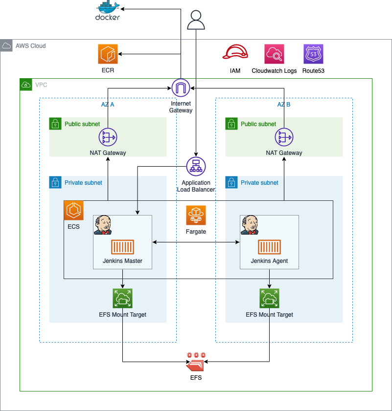

# Serverless Jenkins on ECS Fargate

This is the repository for the official tecRacer three-part blog series.

Part 1: [Serverless Jenkins on ECS Fargate: Part 1](https://www.tecracer.com/blog/2023/05/serverless-jenkins-on-ecs-fargate-part-1.html).

Part 2: [Serverless Jenkins on ECS Fargate: Part 2](https://www.tecracer.com/blog/2023/05/serverless-jenkins-on-ecs-fargate-part-2.html).

Part 3: [Serverless Jenkins on ECS Fargate: Part 3](https://www.tecracer.com/blog/2023/05/serverless-jenkins-on-ecs-fargate-part-3.html).

# Architecture

As an introduction, I would like to guide you through the infrastructure that we will set up. The diagram below displays the target architecture that we will build and deploy.

We will start by building the network infrastructure. The network will include the vpc, the subnets, the internet gateway, nat gateways, and route tables. The nat gateways are needed to allow our Jenkins Controller and Agents to reach the public Internet. Public Internet access is needed to download container images from ECR and communicate with AWS Service APIs. To keep this setup simple, VPC Endpoints were not used to reach AWS Services securely.

Once the network has been deployed, we will continue by setting up an ECS cluster. The ECS cluster will be used to run our ECS Service and Fargate tasks. In order to store data and the Jenkins configuration highly available across multiple availability zones, an AWS elastic file share (EFS) will be used. Decoupling the storage from the lifecycle of the containers greatly improves the reliability of the solution. In case of a Jenkins node failure, the container can be shut down without data loss. New containers will be able to access the data and configuration via EFS.

To access our Jenkins Controller node from outside AWS, an application load balancer will be deployed.

## Try it yourself

### Prerequisites

- [Terraform](https://developer.hashicorp.com/terraform/downloads)
- [Docker](https://www.docker.com/)
- An AWS Account

### Setup

1. Clone the repo
2. Execute `docker build -t jenkins-agent .` in the folder `docker/jenkins-agent` to build the custom Jenkins Agent image
3. Execute `docker build -t jenkins-controller .` in the folder `docker/jenkins-controller` to build the custom Jenkins Controller image
4. Run `terraform init` to initialize the Terraform environment
5. Run `terraform apply -target=aws_ecr_repository.this` to create an AWS Container Registry
6. Upload the custom Jenkins Controller and Agent images to ECR using the [official AWS documentation](https://docs.aws.amazon.com/AmazonECR/latest/userguide/docker-push-ecr-image.html)
7. Run `terraform plan` and `terraform apply` to deploy the rest of the infrastructure
8. Open the Jenkins URL defined in the Terraform Output `jenkins_url` and login to Jenkins using the Username `admin` and Password `admin`
9. Start the predefined Jenkins task `serverless-jenkins-on-ecs`

### Result

Terraform will deploy an serverless Jenkins Controller/Agent pipeline on ECS. You will be able to execute a predefined example pipeline that will deploy Terraform code to you AWS account.

### Teardown

1. Delete the custom Jenkins Controller and Agent Docker images from ECR
2. Run `terraform destroy` to remove the infrastructure
