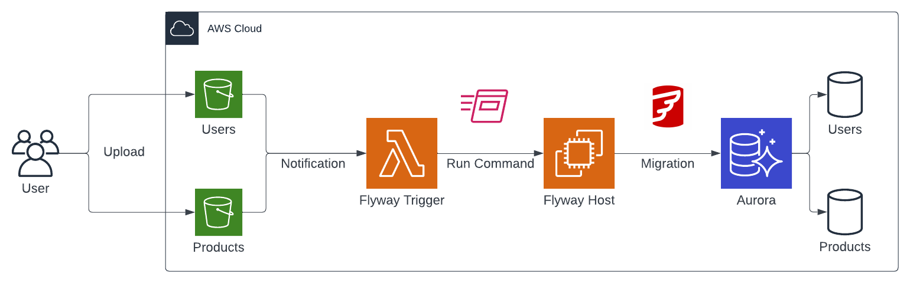

# Version Control your Database: Use Flyway on AWS to automate database migrations and increase deployment reliability

This is the repository for the official tecRacer blog post [Version Control your Database: Use Flyway on AWS to automate database migrations and increase deployment reliability](https://www.tecracer.com/blog/2023/03/version-control-your-database-use-flyway-on-aws-to-automate-database-migrations-and-increase-deployment-reliability.html).

# Architecture

As an introduction, I would like to guide you through the infrastructure that we will set up. As seen in the architecture diagram below, we will create a simple pipeline consisting of S3 Buckets, Lambda, SSM, EC2, and an Aurora Serverless cluster.

We will start by setting up a couple of S3 Buckets. We will create an S3 Bucket for each Database that should be managed by Flyway. In our example, we will manage two databases in our Aurora Serverless cluster, `Users` and `Products`, and will therefore create two corresponding Buckets. Each S3 Bucket will contain the versioned Flyway migration files for its database. Every time a file is uploaded to one of the S3 Buckets, a Lambda function will be triggered. The Lambda function functions as the `Flyway Trigger` and will execute an `SSM Run Command` on the `Flyway Host`. The `Flyway Host` is an EC2 Instance that has Flyway installed and is able to connect to the Aurora cluster. The `SSM Run Command` will execute Flyway on the `Flyway Host` and perform the database migration.

## Try it yourself

### Prerequisites

- [Terraform](https://developer.hashicorp.com/terraform/downloads)
- An AWS Account

### Setup

1. Clone the repo
2. Run `terraform init` to initialize the Terraform environment
3. Run `terraform plan` and `terraform apply` to deploy the infrastructure
4. Upload migration files from the directory `migrations/` into the S3 Bucket with the prefix `Users`
5. Evaluate changes in the Aurora Serverless Cluster

### Result

Terraform will deploy an empty Aurora Serverless cluster. By uploading `Flyway` migration files to the S3 Bucket `Users`, automated database migrations will be triggered. When uploading the files `V1__create_table_persons.sql` and `V2__alter_table_persons.sql` to the S3 Bucket, the table `Persons` will be created and altered on the database `Users`.

### Customization

The architecture is meant to serve as a starting point and an example. There are multiple ways to make the solution more robust and efficient. One possibility would be to automate the S3 Bucket upload via [GitHub Actions](). If you feel comfortable enough you can also add the AWS SDK dependencies to `Flyway` and use the inbuild S3 support instead of using the `aws s3 sync` command.

### Teardown

Run `terraform destroy` to remove the infrastructure.
