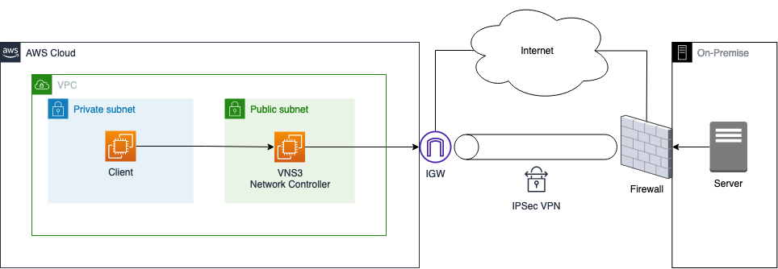
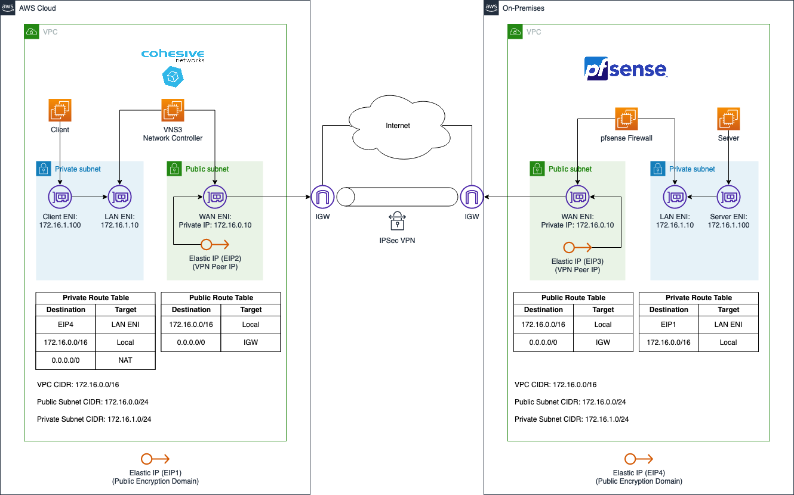

# Build a Site-to-Site IPSec VPN with Public Encryption Domain

This is the repository for the official tecRacer blog post [Build a Site-to-Site IPSec VPN with Public Encryption Domain](https://www.tecracer.com/blog/2023/06/build-a-site-to-site-ipsec-vpn-with-public-encryption-domain.html).

# Architecture

As an introduction, I would like to guide you through the infrastructure that we will set up as part of this blog post. The diagram below displays a high-level overview of the setup we are trying to simulate.

The goal is to create an IPSec Site-to-Site VPN tunnel between AWS and an on-premises data center. As the requirement is to use public encryption domains, we will leverage third-party appliances on EC2 to create the VPN connection. To keep this example as simple as possible, we will set up the AWS as well as the on-premises environment in AWS. The diagram below displays the target architecture in detail that we will build and deploy.

We will set up two VPCs in AWS. The first `AWS Cloud` VPC on the left-hand side will represent a normal AWS network while the `On-Premises` VPC on the right-hand side will be used to simulate the on-premises network. Both VPCs will be connected via a Site-to-Site IPSec VPN connection to allow secure and encrypted communication between the networks.

The AWS Cloud VPC will use the CIDR range `172.16.0.0/16` and will consist of two subnets. A private subnet with the IP range `172.16.1.0/24` as well as a public subnet with the IP range `172.16.0.0/24`. A client application will be running in the private subnet and will need to communicate with a server running in the On-Premises VPC. 

The On-Premises VPC will use the same CIDR range `172.16.0.0/16` and will consist of two subnets as well. A private subnet with the IP range `172.16.1.0/24` as well as a public subnet with the IP range `172.16.0.0/24`. A server that needs to be reachable by the client application located in the AWS Cloud VPC will be running in the private subnet of the On-Premises VPC. 

To allow communication between server and client, we will set up a Site-to-Site IPSec VPN connection over the public Internet. We will leverage two third-party appliances called `VNS3` and `pfSense` to do so. VNS3 is a software-only virtual router, switch, and firewall appliance that allows users to control access and network topology and secure data in motion across public and private clouds. pfSense is a firewall/router computer software distribution based on FreeBSD.

The VPN connection itself will be set up between two EC2 instances running one of the virtual appliances each. The EC2 instance in the AWS Cloud VPC will be running VNS3 while the EC2 instance in the On-Premises VPC will be running pfSense. Both EC2 instances will have two Elastic Network Interfaces, a `LAN ENI` as well as a `WAN ENI`. The LAN ENI will be placed in the corresponding private subnet of each VPC and will allow EC2 instances running in the private subnets to forward VPN traffic to the virtual appliance. The LAN ENI will only be assigned a private IP address. The WAN ENI will be placed in the public subnet of the VPCs and will function as the entry point to the networks. Besides the private IPs, they will also be assigned a static public IP each by using `Elastic IPs`. The public IPs will be used as the `VPN Peer IPs` and will allow the creation of an IPSec VPN connection between the two VPCs.

Besides the `Elastic IPs (VPN Peer IP)`, we will also request additional `Elastic IPs (Public Encryption Domain)`. These public IPs will not be assigned to an ENI and will be used for the public encryption domain of our VPN connection. We will use the NAT functionality of the third-party appliances, VNS3 and pfSense, to map the private IPs of the server and client to the unassigned Elastic IP before forwarding the traffic to the other VPC via the VPN tunnel. Traffic originating from the AWS Cloud or On-Premises VPCs will therefore seem to be coming from the corresponding Elastic IPs (Public Encryption Domain).

## Try it yourself

### Prerequisites

- [Terraform](https://developer.hashicorp.com/terraform/downloads)
- An AWS Account

### Setup

As this example includes manual configuration steps, please follow the step-by-step instructions of the original [blog post](https://www.tecracer.com/blog/2023/06/build-a-site-to-site-ipsec-vpn-with-public-encryption-domain.html).

### Result

Terraform will deploy VPN Appliances that will allow you to create an IPSec VPN using a Public Encryption Domain.

### Teardown

Run `terraform destroy` to remove the infrastructure
